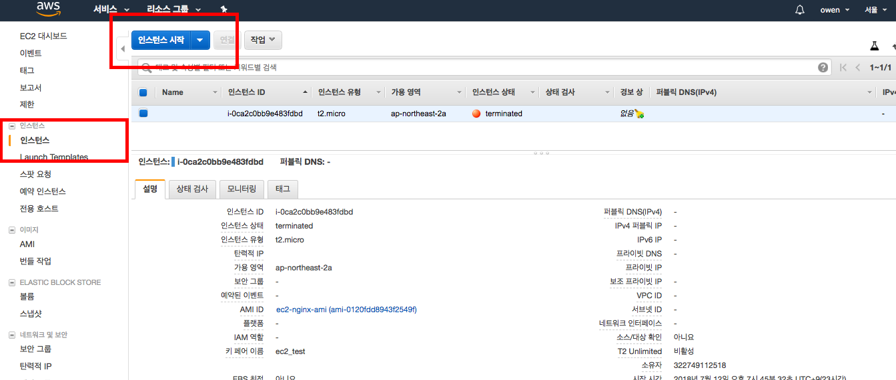
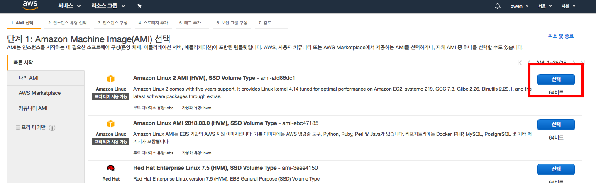
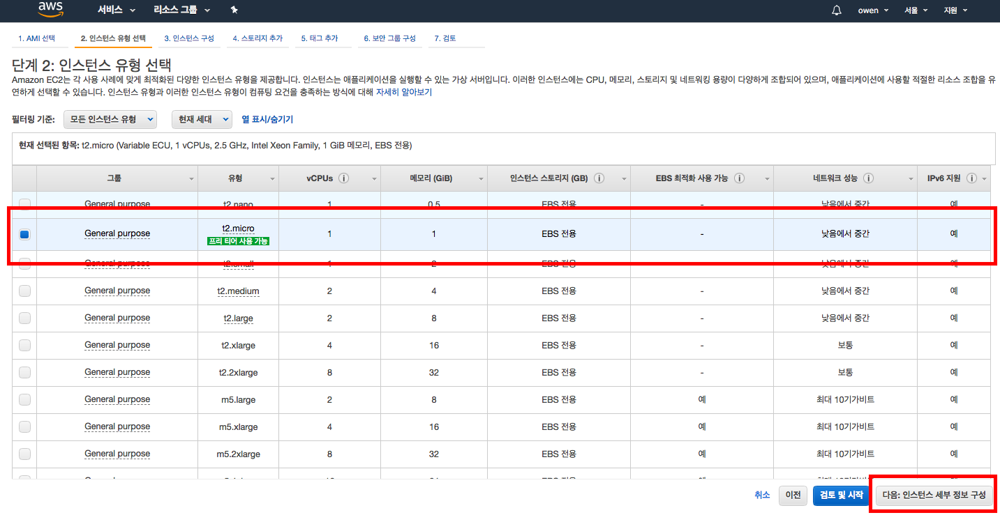
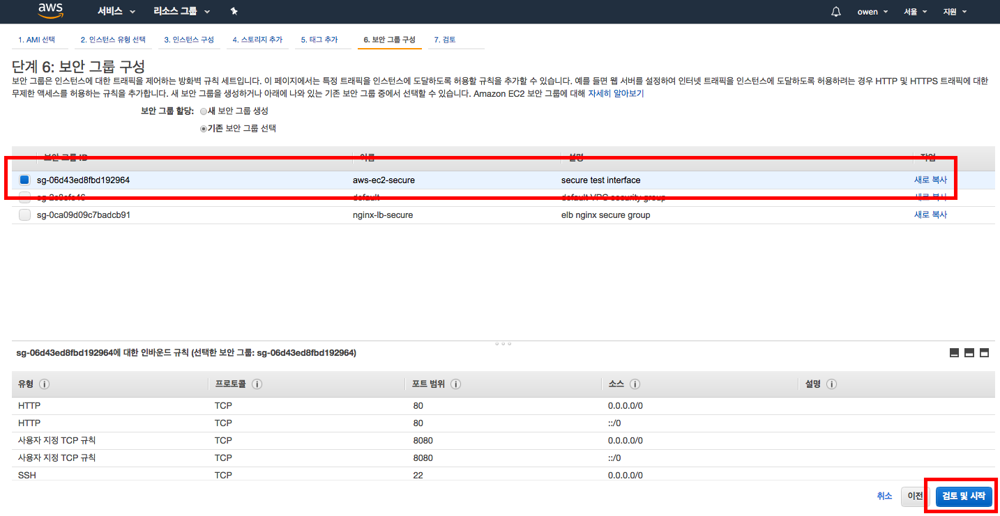
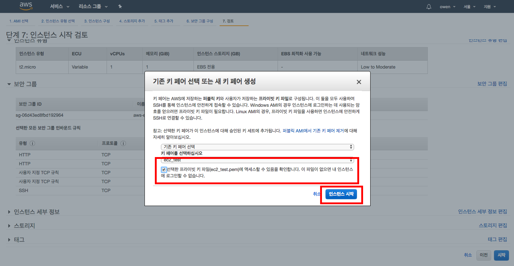
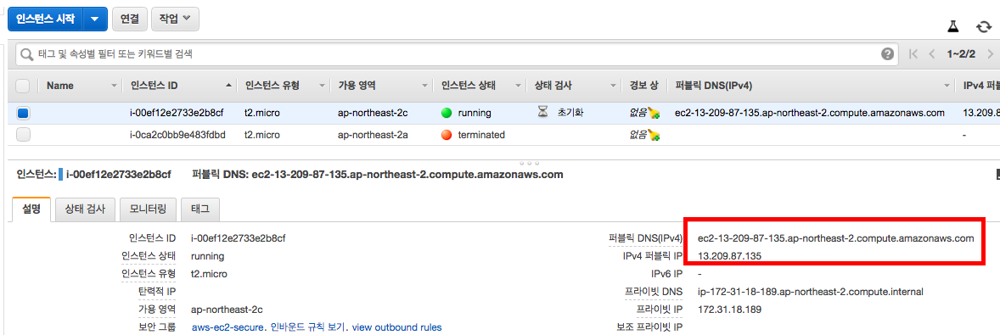

# AWS EC2, Nginx 설치/운영
## AWS EC2 인스턴스 생성하기


1. AWS Management console에 로그인 후 접속합니다.
2. 서비스 - EC2 클릭 후 인스턴스 시작 버튼 클릭
</br></br>



1. Amazon Linux 2 AMI (HVM), SSD Volume Type를 기반으로 생성합니다.
</br></br>


1. 인스턴스 유형 선택에서 t2.micro(프리 티어)를 체크합니다.
2. 하단 - 다음:인스턴스 세부 정보 구성 버튼을 클릭합니다.
3. 3\. 인스턴스 구성, 4\. 스토리지 추가, 5\. 태그 추가 탭에 설정할 내용은 현재는 기본 값을 사용하기 때문에 다음 스텝으로 넘어갑니다.
4. 6\. 보안 그룹 구성 탭까지 이동합니다.
</br></br>


1. 기존 보안 그룹 선택 클릭
2. 1주차에 작성한 보안 그룹인 aws-ec2-secure을 클릭합니다.
    - ssh(22), http(80) 포트만 설정되어있으면 됩니다. (하단 참조)
3. 검토 및 시작을 클릭합니다.
</br></br>



1. 검토 탭에서 하단 - 시작 버튼을 클릭하면 키 페어 선택 팝업이 뜹니다.
2. 1주차에 만든 SSH 퍼블릭 키를 사용하기 위해 기존 키 페어 선택 - ec2_test를 각각 체크합니다.
3. 하단 "선택한 프라잆 키 파일에 액세스할 수 있음을 확인합니다. ~~~" 내용에 체크합니다.
4. 인스턴스 시작 버튼 클릭
5. 인스턴스 보기 버튼 클릭
</br></br>


1. 방금 생성한 EC2 인스턴스 상태가 Pending에서 running으로 바뀐 것을 확인합니다.
2. 하단 - 설명 탭을 클릭하고 퍼블릭 DNS 주소를 복사합니다.
```bash
sudo ssh -i ~/Desktop/ec2_test.pem ec2-user@{ec2_dns}
```
3. ssh 클라이언트를 통해 방금 생성한 EC2 인스턴스로 접속합니다.
</br></br>

## Nginx 설치
> 모든 과정에서 `permission denined` 에러가 발생할 경우 `sudo su` 명령어 혹은 명령어 앞에 `sudo`를 붙이셔서 root(관리자) 권한으로 실행합니다.

</br>

### Nginx 설치, 실행
```bash
sudo su # 루트 권한으로 실행
amazon-linux-extras install -y nginx1.12 # amazon-linux-extras 레포지토리를 통해 nginx1.12 설치
service nginx start # service 명령어를 통해 nginx 백그라운드에서 실행
```

</br>

### Git 설치, 웹 프로젝트 받아오기
```bash
yum install -y git # yum 레포지토리를 통해 git 설치
cd /usr/share/nginx/html/ # Nginx root 디렉토리로 이동
git clone https://github.com/owen1025/Fastcampus-web-deploy.git # Fast-web-deploy 프로젝트 코드 받아오기
```
> 이 이후 해당 인스턴스 DNS 주소로 웹 브라우저에 접속해서 웹 페이지가 정상적으로 작동하는 지 확인합니다. `ex) http://ec2-13-209-87-135.ap-northeast-2.compute.amazonaws.com/Fastcampus-web-deploy/page/album/`

</br>

### Nginx 환경 설정 파일 수정
```bash
find / -name nginx.conf # nginx 설정 파일 위치 찾기
cd /etc/nginx # 해당 경로로 이동
cp nginx.conf nginx-copy.conf # 잘못된 수정을 하면 원래 상태로 백업을 위해 기존 설정 파일 복사
vi nginx.conf # vi 편집기로 열기
```

```bash
server {
    listen       80 default_server;
    listen       [::]:80 default_server;
    server_name  _;
    root         /usr/share/nginx/html/Fastcampus-web-deploy;

    # Load configuration files for the default server block.
    include /etc/nginx/default.d/*.conf;

    location / {
    }

    location ~* /(album|signin) {
        root /usr/share/nginx/html/Fastcampus-web-deploy/page;
    }

    error_page 404 /404.html;
        location = /40x.html {
    }

    error_page 500 502 503 504 /50x.html;
        location = /50x.html {
    }
}
```
> 파일 중간 server{} 안 내용 중 root의 directory 위치와 location ~* /(album|signin) {} block 내용을 추가하고 `:wq` 키워드로 vi 편집기를 저장하고 종료합니다.

</br>

```bash
service nginx reload # nginx.conf 수정 내용을 적용하기 위해 NginX를 재기동합니다.
```
> 이 이후 웹 브라우저에 접속하여 디렉토리를 생략하더라도 웹 페이지가 정상적으로 작동하는 지 확인합니다. `ex) http://ec2-13-209-87-135.ap-northeast-2.compute.amazonaws.com/album/`

</br>

```bash
systemctl enable nginx # AMI 빌드를 위해 인스턴스 시작(재부팅)시 자동으로 nginx를 실행합니다.
```