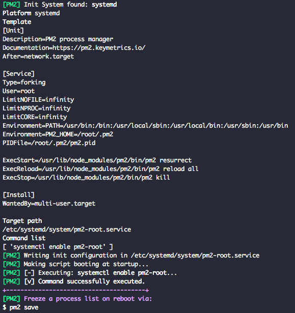

# WAS 설정, ELB 생성, 설정 후 연결하기
## WAS AMI 빌드

### PM2 부팅(재기동) 자동 실행 등록
> AMI 빌드시 자동으로 PM2로 node.js 프로젝트(WAS)를 실행하기 위해 등록하는 과정입니다.

```bash
pm2 startup
```

해당 명령어 실행 시



위와 같이 자동으로 시스템 부팅(재기동) 시 현재 구동되고 있는 pm2 프로세스들을 기록하여 기동하는 스크립트가 작성됩니다. 이를 저장하기 위해

```bash
pm2 save
```

명령어를 실행하면 아래와 같이 위에서 자동으로 작성된 스크립트가 저장됩니다.


</br>


> AWS 콘솔 -> WAS가 구동되는 인스턴스 선택 -> 작업 -> 재부팅

방금 설정한 WAS가 구동되는 인스턴스를 재기동한 뒤 POSTMAN으로 재기동해도 API 요청/응답이 정상적으로 작동하는 지 확인합니다.

### WAS 설정 기반 AMI 빌드


> AMI 빌드를 위해 기반으로 할 인스턴스 선택(윗 단계에서 설정한 WAS) -> 작업 -> 이미지 -> 이미지 생성


1. 이미지 이름 입력(ex. was-nodejs-ami)
2. 이미지 설명(ex. nodejs + pm2 + fastcampus-api-deploy)
3. 이미지 생성(3~7분 대기)


### AMI(WAS) 기반 EC2 인스턴스 생성


1. EC2 인스턴스 생성하기
2. AMI 선택 탭에서 왼쪽 탭 두번째에 위치한 나의 AMI 선택
3. 방금 생성한 was-nodejs-ami 선택

> 기존 EC2 인스턴스 생성 방법과 동일합니다. 6. 보안 그룹 구성까지 기본 값을 사용합니다.

</br>


해당 WAS AMI는 `8080`포트로 통신합니다. 기존 생성된 보안 그룹인 `nodejs-was-secure`을 사용합니다. (8080포트 / 22포트 - SSH를 확인합니다)

생성이 끝나시면 생성이 완료된 DNS 주소로 8080포트를 통해 POSTMAN으로 API 요청/응답이 제대로 작동하는 지 확인합니다.

</br>

## ELB를 생성하여 두 대의 WAS 인스턴스 연결

1. 로드밸런서 탭 -> 로드밸런서 생성
2. 맨 오른쪽 Classic load balancer 생성 버튼 클릭


1. 로드 밸런서 이름 입력 (ex. was-lb)
2. 하단 리스너 구성
    - 로드밸런서 포트와 인스턴스 포트를 각각 8080포트로 입력해줍니다.


1. 8080포트가 뚫려있는 기존 생성한 보안 그룹인 nodejs-was-secure을 선택합니다. 
2. `4. 상태 검사 구성`까지 이동합니다


- 헬스 체크 설정 내역입니다.
- 앞서 설정한 포트인 `8080`을 Ping 포트 기본값으로 설정되있습니다.
- Ping 경로를 /index.html이 아닌 API url `/`로 변경합니다.
- `5. EC2 인스턴스 추가`로 이동합니다.


- 저희는 WAS 인스턴스를 연결할 로드밸런서를 설정하고 있습니다. WAS가 구동되고 있는 두 개의 인스턴스를 선택합니다.
- 인스턴스의 이름을 미리 설정해두면 헷갈리지 않습니다.
- 혹시 이름을 설정해두지 않으셨다면 보안 그룹에 nodejs-was-secure가 설정된 인스턴스들만 선택합니다.
- `7. 검토` 탭까지 이동하셔서 생성 버튼을 클릭합니다.


- 방금 생성된 로드밸런서(was-lb)를 체크하시고 하단 인스턴스 탭을 확인하셔서 물려있는 두 개의 인스턴스의 상태가(OutofService -> InService)로 변경되기까지 기다립니다.
- 설명 탭에서 해당 로드밸런서의 DNS 주소를 POSTMAN으로 API 요청/응답이 정상적으로 작동되는 지 확인합니다.

