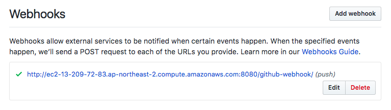
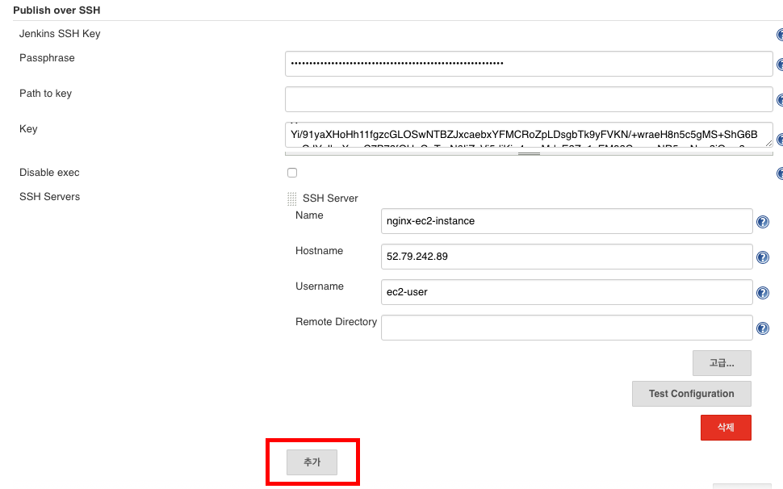

# Jenkins item 생성, Github webhook 연동, SSH 자동 배포 설정
## Github webhook 설정
### Jenkins(Github plugin) 등록
1. https://github.com/owen1025/Fastcampus-api-deploy 접속
2. 상단 오른쪽에 위치한 `fork` 버튼으로 Fastcampus-api-deploy 프로젝트 개인 레포지토리로 포크


3. 포크한 레포지토리로 이동
4. 레포지토리 상단 오른쪽에 위치한 Settings 버튼 클릭
5. 왼쪽 탭에 위치한 `Intergrations & services` 클릭 후 해당 화면에 오른쪽에 위치한 `ADD service` 클릭


6. 입력 박스에 jenkins 입력 후 `Jenkins (Github plugin)` 선택


7. Jenkins가 구동되는 URL 입력
    - {jenkins-ec2-dns}:8080/github-webhook/
    - `ex) ec2-13-209-72-83.ap-northeast-2.compute.amazonaws.com:8080/github-webhook/`
8. `Add service` 버튼 클릭

### Github webhook 등록


1. 같은 화면에 왼쪽에 위치한 `Webhooks` 클릭 후 오른쪽에 위치한 `Add webhook` 버튼 클릭


2. Payload URL 설정
    - 전 단계에서 설정한 URL(http://{jenkins-ec2-dns}:8080/github-webhook/)을 입력해주시면 됩니다.
    - `ex) http://ec2-13-209-72-83.ap-northeast-2.compute.amazonaws.com:8080/github-webhook/`
3. Content type - `application/json`으로 변경
4. 저희는 모든 Push Event시 Jenkins에게 알리기 위해 기존 그대로 `Just the push event`를 사용합니다.
5. `Add webhook` 버튼 클릭



> 해당 화면처럼 정상적으로 등록됬는 지 확인합니다. 체크 표시가 없다면 정상적으로 등록되지 않은거니 저에게 말씀주세요.

## Publish over SSH 설정


1. 웹 브라우저를 통해 Jenkins에 접속합니다.
2. 왼쪽 `Jenkins 관리` - `시스템 설정` 클릭합니다.



3. 시스템 설정 화면에 중간에 위치한 `Publish over SSH` 탭까지 이동합니다.
4. `추가` 버튼 클릭


5. 해당 작업은 WAS 서버에 자동 배포 과정입니다. Fastcampus-api-deploy가 구동되는 WAS(EC2 instance) 서버를 대상으로 작업합니다.
    - Name : was-ec2-instance 입력
    - Hostname : 여러분들의 WAS(node.js)가 구동되는 EC2 인스턴스의 Public IP를 입력합니다.
    - Username : ec2-user 입력
6. 5번 내용 입력이 끝나고 `Test Configuration` 버튼을 클릭하여 연결이 정상적인지 확인합니다.
7. 하단에 위치한 `저장` 버튼을 클릭합니다.

## Jenkins 아이템 생성
1. Jenkins 메인 페이지 왼쪽 탭에 위치한 `새로운 아이템` 버튼 클릭


2. 생성할 Jenkins의 아이템 이름 입력 (`api-cd-test`)
    - `Freestyle project` 클릭
    - 하단에 위치한 `ok` 클릭


3. `GitHub project` 체크박스 클릭
    - Project url에 전 단계에서 포크한 Fastcampus-api-deploy git 레포지토리 url을 입력합니다.


> 포크한 레포지토리로 이동 후 `Clone or download` 버튼을 클릭하시면 해당 레포지토리의 url을 가져올 수 있습니다.


4. 소스 코드 관리 탭에서 `Git` 체크 박스 클릭
    - Respositories
        - Respository URL : `Github project`에서 설정한 동일한 git 레포지토리 url을 입력합니다.
        - Credentials : 수업 시간 때 만든 git 인증 정보를 선택합니다.


5. 빌드 유발 탭에서 앞서 설정한 Github webhook에서 이벤트 발생 시 아이템을 실행하기 위한 트리거를 달기 위해 `GitHub hook trigger for GITScm polling` 체크박스를 클릭합니다.


6. 하단에 위치한 `빌드 후 조치` 탭에서 `빌드 후 조치 추가` 버튼을 클릭하고 `Send build artifacts over SSH`를 클릭하여 SSH를 통해 원격 배포 설정을 진행합니다.
    - SSH Server
        - 전 단계에서 미리 설정해 둔 SSH Server(was-ec2-instance)를 체크합니다.
    - Transfers
        - Source files : 모든 파일을 배포하기 위해 `**/*`을 입력합니다.
        - Remote directory : 배포할 파일이 해당 인스턴스 어디에 위치할 것인지에 대한 디렉토리 경로를 입력합니다. 해당 실습에선 기존에 운영되던 프로젝트 디렉토리를 피하기 위해 임시적으로 `/Fastcampus-api-deploy-temp` 디렉토리를 사용합니다.
        - Exec command : 배포가 끝나고 실행할 명령어들의 모음입니다.
        ```bash
        sudo rm -rf Fastcampus-api-deploy # 기존 운영되던 프로젝트 삭제
        sudo mv Fastcampus-api-deploy-temp/ Fastcampus-api-deploy/ # 배포한 프로젝트의 이름 변경
        cd Fastcampus-api-deploy/ # 배포한 프로젝트 경로로 이동
        npm install # package.json에 명시된 모듈들 NPM을 통해 다운로드
        sudo pm2 restart WAS # PM2를 통해 WAS 프로세스 restart(코드 적용)
        ```
7. 하단 `저장` 버튼을 클릭합니다.
8. Jenkins 메인 페이지에서 방금 생성한 `api-cd-test` 아이템의 오른쪽에 위치한 시계 아이콘을 클릭하여 아이템을 실행하고 정상적으로 작동하는 지 확인합니다.