# AWS ECR, ECS, ALB 설정
## AWS ECR(Docker repository) 설정 및 Docker image push
1. AWS Management Console 접속 > AWS 서비스 탭에서 `Elastic Container Service` 검색하여 클릭 > 왼쪽 탭에서 리포지토리 선택 후 `리포지토리 생성` 버튼 클릭

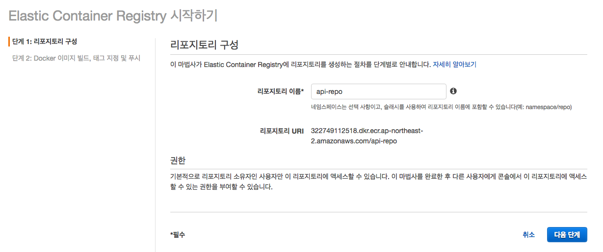

2. 리포지토리 이름(`api-repo`) 입력 > `다음 단계` 버튼 클릭

```bash
aws ecr get-login --no-include-email --region ap-northeast-2 # 로컬 환경의 docker repository AWS ECR 인증 진행 > 인증이 진행 후 나오는 docker login ~~ 복사 후 명령어 실행
docker tag api:0.1 322749112518.dkr.ecr.ap-northeast-2.amazonaws.com/api-repo:latest # 도커 이미지(api:0.1)에 태그 부여, 본인 ECR(전 단계에서 만든 api-repo) {ECR-URL:latest} 입력
docker push 322749112518.dkr.ecr.ap-northeast-2.amazonaws.com/api-repo:latest # {ECR-URL}:latest 이미지를 ECR로 Push 진행
```

</br>

## AWS ECS 설정
### AWS ECS 클러스터 생성
> 해당 내용은 현재 과정에서 따로 진행하지 않습니다. 나중에 확인하실 참고용 자료로 남겨두며 앞으로 할 컨테이너 배포는 기존에 생성된 클러스터에서 진행하시면 됩니다.

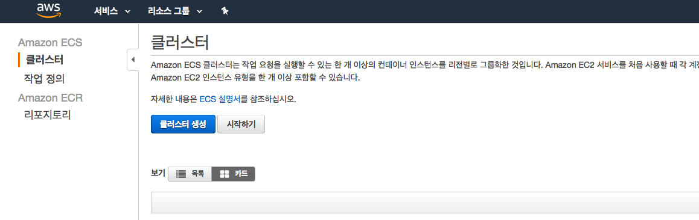

1. `Elastic Container Service` > 클러스터 탭 클릭 > `클러스터 생성` 버튼 클릭 > `EC2 Linux + 네트워킹` 선택 > `다음 단계` 클릭

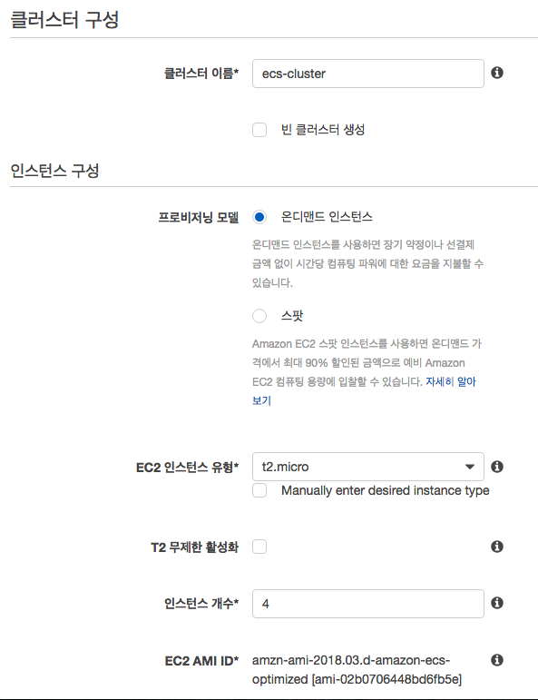

2. 클러스터 - 구성 설정
    - 클러스터 이름(`ecs-cluster`) 입력
    - EC2 인스턴스 유형(`t2.micro`) 선택
        - 실습을 위해 요금이 부과되지 않는 free-tier EC2 인스턴스를 기반으로 클러스터링을 구성합니다.
    - 인스턴스 개수(`4`) 입력

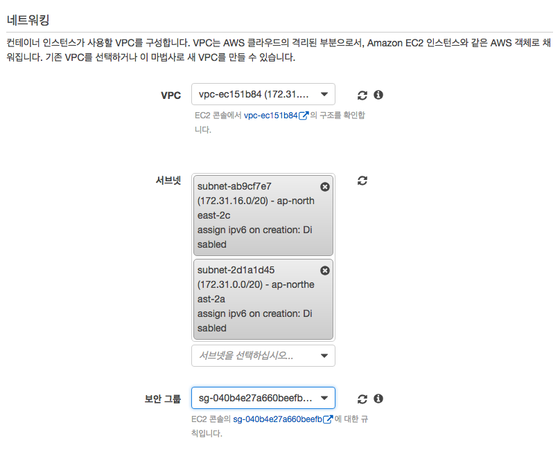

3. 클러스터 - 네트워크 설정
    - 기본 VPC / 서브넷을 사용합니다.
        - 4주차에 진행한 AWS 네트워킹 수업 내용 참고
        - 필요할 경우 VPC / (Public, Private) Subnet을 만들어 적용합니다.
    - 보안그룹 적용
        - 해당 클러스터에 구성되는 EC2 인스턴스 내엔 WAS 컨테이너가 구성됩니다. 해당 컨테이너들은 다이나믹 포트로 통신되기에 Host 머신인 EC2 인스턴스의 보안 그룹(방확벽)은 모든 포트 요청이 허용되야합니다.

4. `컨테이너 인스턴스 IAM 역할` > `ecsInstanceRole` 선택 후 `생성` 버튼 클릭


### AWS ECS 작업 정의 구성 생성 및 설정

1. `Elastic Container Service` > 왼쪽 `작업 정의` > `새 작업 정의 생성` 클릭

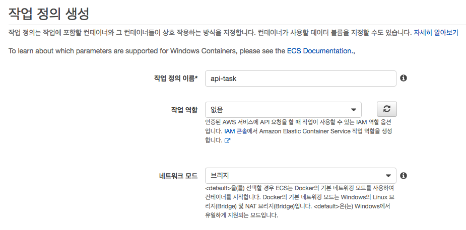

2. 작업 정의 생성
    - 작업 정의 이름(`api-task`) 입력
    - 작업 역할(`없음`) 선택
    - 네트워크 모드(`브리지`) 선택
        - Host 머신과 컨테이너의 포트를 직접 연결이 아닌 다이나믹 포트로 연결하기 위해 `브리지`로 네트워크 모드를 구성합니다.

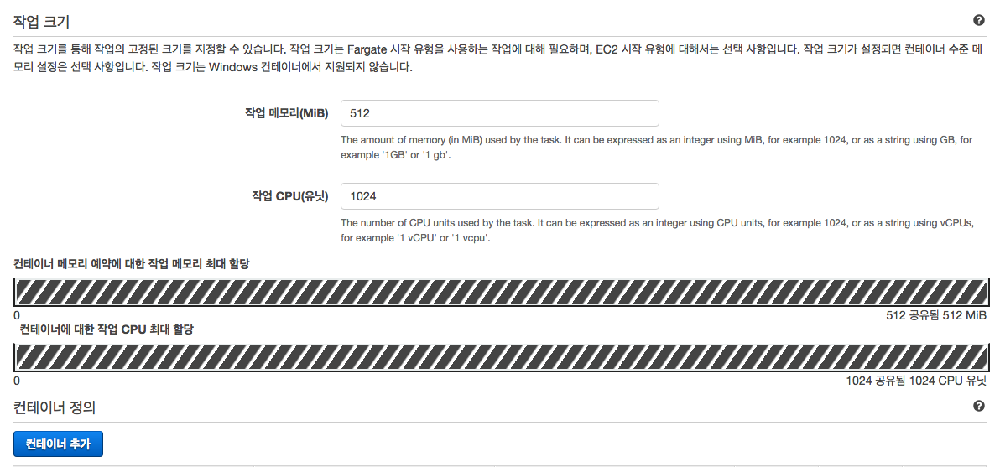

3. 작업 크기 설정
    - 작업 메모리(`512`) 입력
    - 작업 CPU(`1024` = 1vCPU) 입력
    - 하단 `컨테이너 추가` 클릭

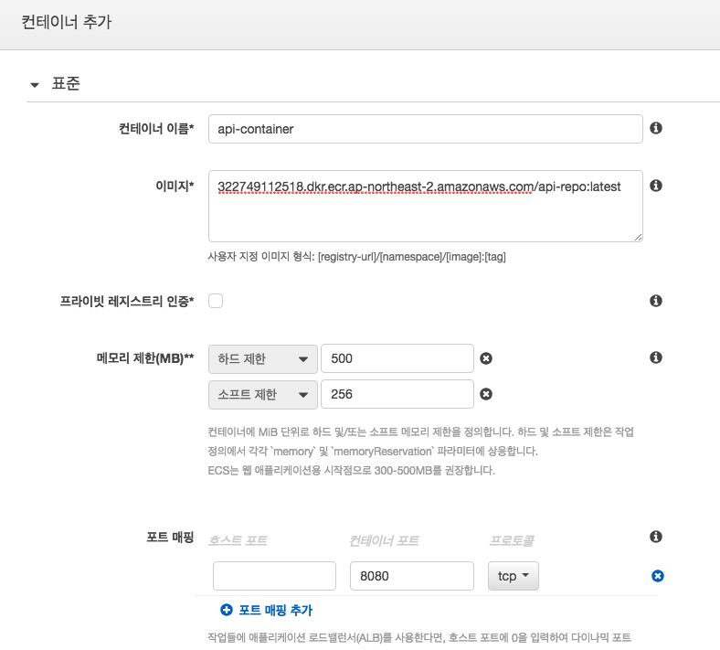

4. 컨테이너 추가 설정
    - 컨테이너 이름(`api-container`) 입력
    - 이미지(`{ECR-API-REPO-URL}:latest`) 입력
        - 앞서 설정한 ECR - `api-repo`의 URL:latest를 입력합니다.
    - 메모리 제한
        - 하드 제한(`500`) 입력
        - 소프트 제한(`256`) 입력
    - 포트 매핑
        - 컨테이너 포트(`8080`) 입력
            - 앞서 해당 컨테이너는 `브리지` 네트워크 모드로 설정되어있습니다. 다이나믹 포트로 매핑하기 위해 `호스트 포트`는 비워둡니다.
5. 하단 `생성` 클릭

### AWS ALB Target group - Container 생성 및 설정

1. AWS Management Console > EC2 > 왼쪽 로드밸런싱 탭에 있는 `대상 그룹` 클릭 > `대상 그룹 생성` 버튼 클릭

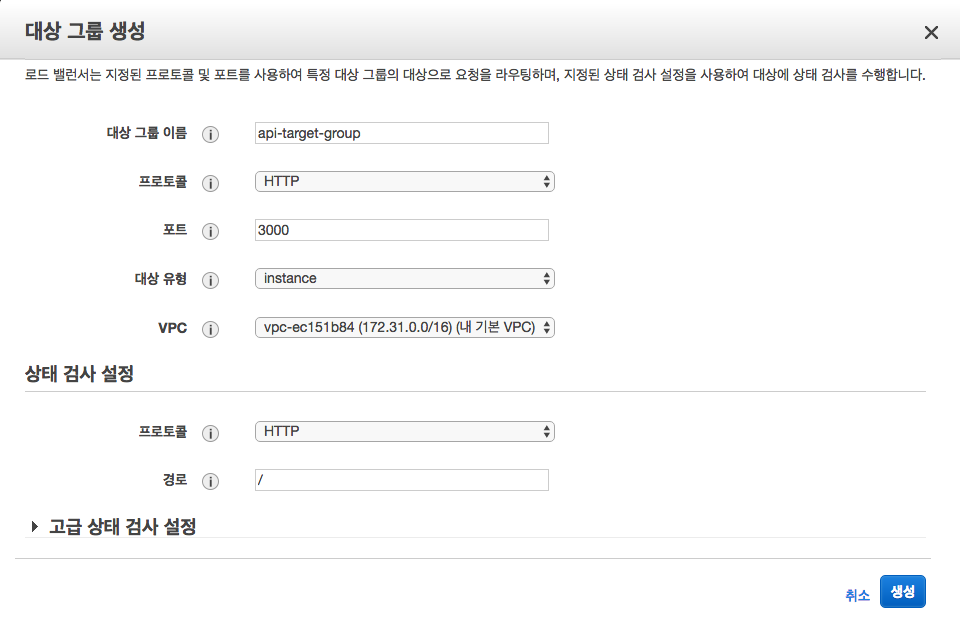

2. 대상 그룹 생성 설정
    - 대상 그룹 이름(`api-target-group`) 입력
    - 포트(`3000`) 입력
        - 해당 대상 그룹에 묶일 컨테이너(`api-container`)는 WAS(Node.js)가 운영되는 환경입니다. 해당 컨테이너 내부(EXPORT)는 8080이며 로드밸런서로 들어온 요청(3000번 포트)를 다이나믹 포트로 연결되있는 대상 그룹의 컨테이너들에게 요청을 분산합니다. 

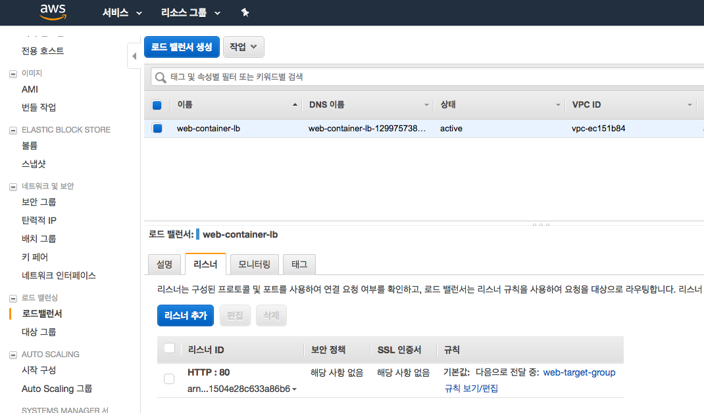

3. 로드밸런서 탭 > `web-container-lb` 클릭 > 하단 `리스너` 탭 클릭 후 `리스너 추가` 버튼 클릭

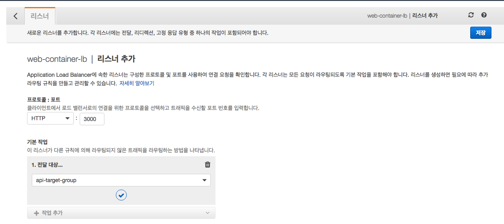

4. `web-container-lb` 리스너 추가
    - 프로토콜 : 포트(HTTP : `3000`) 입력
        - `api-target-group`은 해당 ALB에 들어온 3000번대 요청을 컨테이너 분산합니다. 3000번 포트로 들어온 요청을 다이나믹 포트와 연결된 `api-container` * N대로 요청을 전달합니다.
    - `1. 전달 대상...` 선택 > `api-target-group` 선택 > 저장

### AWS ECS 클러스터 내 서비스(컨테이너) 생성 및 설정

1. AWS Management Console > `Elastic Container Service` > `클러스터` > `ecs-cluster` 클릭
2. 하단 `서비스` 탭 내에 있는 `생성` 버튼 클릭

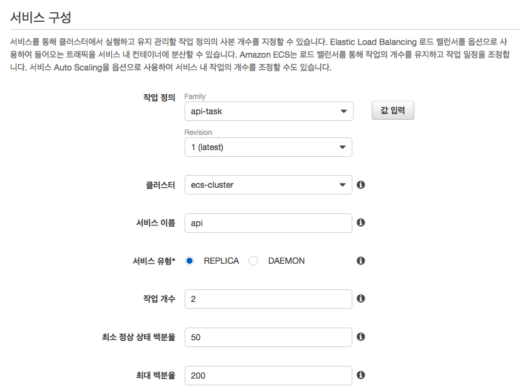

3. 서비스 구성 설정
    - 작업 정의(`api-task`) 선택
    - 작업 개수(`2`) 입력
        - 두 개의 컨테이너를 `ecs-cluster` 내에 생성합니다.
    - 하단 `다음 단계` 버튼 클릭

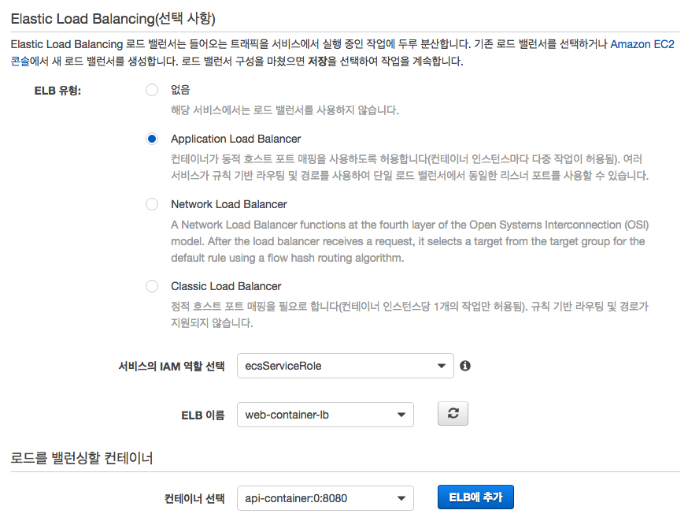

4. `Elastic Load Balancing` 설정
    - ELB 유형(`Application Load Balancer`) 선택
    - 서비스의 IAM 역할 (`ecsServiceRole`) 선택
    - ELB 이름(`web-container-lb`) 선택
    - 컨테이너 선택(`api-container:0:8080`) 클릭 후 `ELB에 추가` 버튼 클릭

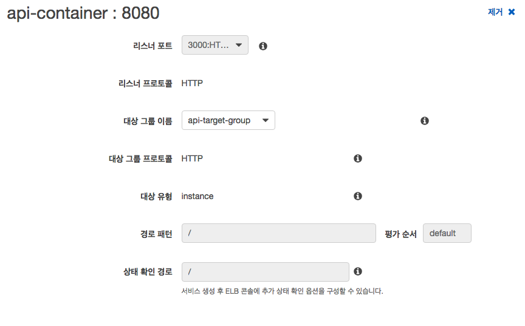

5. 대상 그룹 선택
    - 중간에 위치한 `대상 그룹 이름`에서 앞서 생성한 대상 그룹인 `api-target-group`을 선택하면 나머지 값들이 설정한 값으로 적용됩니다.
    - 하단 `다음 단계` 버튼 클릭
    - Auto Scaling은 건너뜁니다.
    - `서비스 검토` 탭에서 앞서 설정한 정보들을 확인 후 하단 `서비스 생성` 버튼을 클릭합니다.


## AWS Codepipeline + Codebuild + ECS CI/CD 무중단 파이프라인 구축
### AWS Codepipeline 생성 및 설정

1. AWS Management Console > `Codepipeline` > `파이프라인 생성` 버튼 클릭
2. 파이프라인 이름(`ecs-api-pipeline`) 입력 > `다음 단계` 버튼 클릭


3. 소스 설정
    > 해당 과정을 통해 Github webhook이 자동으로 설정되며 설정한 리포지토리/브랜치에 Push 이벤트 발생시 해당 Pipeline이 실행됩니다.
    - 소스 공급자(`Github`) 선택 > `Github 연결` 버튼 클릭 후 로그인 or 인증
    - 리포지토리(`{My_Github_Username}`/Fastcampus-api-deploy) 선택
    - 브랜치(`container`) 선택
    - `다음 단계` 클릭

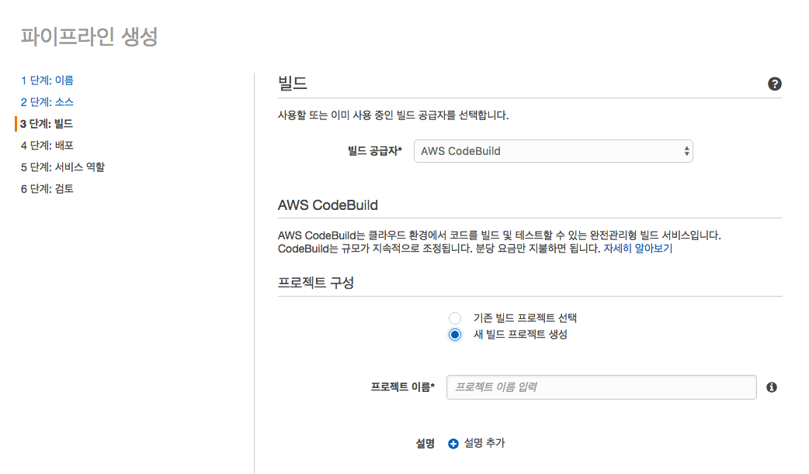

### AWS Codedeploy 및 iAM 설정

1. 빌드 설정
    > AWS Codebuild를 통해 리포지토리 내에 Dockerfile을 기반으로 자동으로 Docker image 빌드를 수행합니다.
    - 빌드 공급자(`AWS CodeBuild`)  tjsxor
    - `새 빌드 프로젝트 생성` 선택
    - 프로젝트 이름(`api-build`) 입력

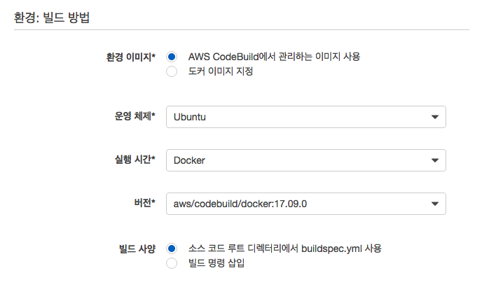

2. 환경: 빌드 방법 설정
    - 환경 이미지(`AWS CodeBuild에서 관리하는 이미지 사용`) 선택
    - 운영 체제(`Ubuntu`) 선택
    - 실행 시간(`Docker`) 선택
    - 버전(`aws/codebuild/docker...`) 선택

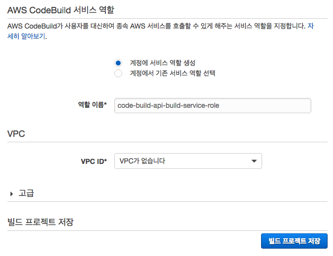

3. AWS CodeBuild 서비스 역할 설정
    - `계정에 서비스 역할 생성` 선택
    - 역할 이름 > 기본값 사용
    - `빌드 프로젝트 저장` 버튼 클릭
    - 해당 AWS Codebuild 아이템에 역할 부여를 위해 AWS Management Console > iAM으로 이동합니다.

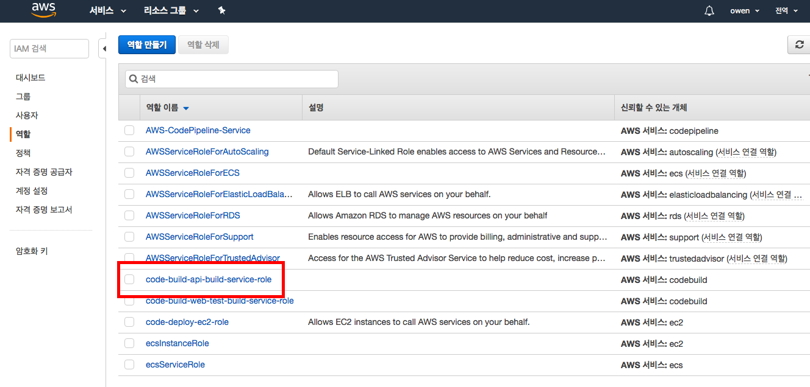

4. AWS Codebuild에 역할 부여
    - iAM 콘솔로 이동 후 왼쪽 탭에서 `역할` 탭을 클릭하면 앞서 설정한 Codebuild 역할로 자동 생성된 `code-build-api-build-service-role`를 클릭합니다.
    - `요약` 탭 하단 `권한` 탭에서 `정책 연결` 버튼을 클릭합니다.

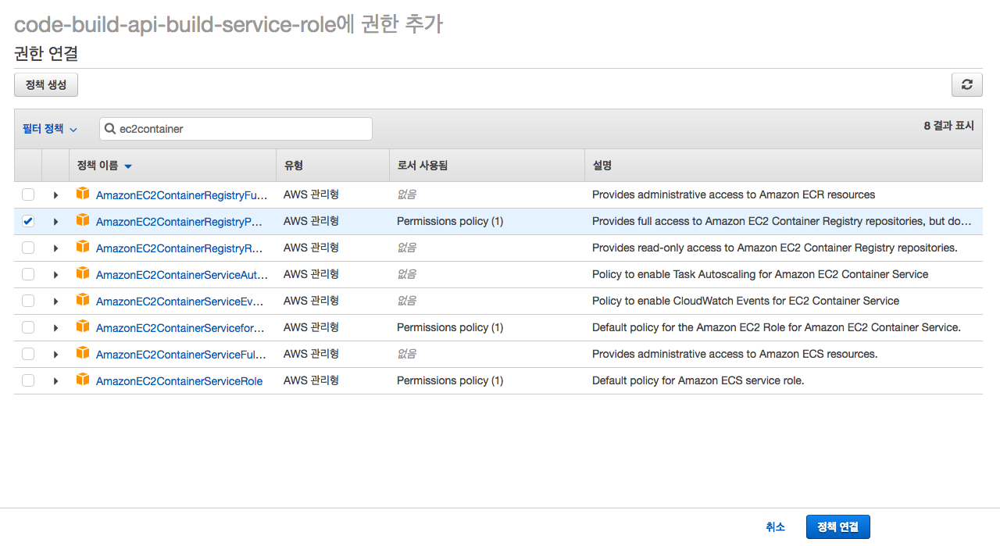

> 해당 사진처럼 `ec2container`로 검색하면 관련 권한 리스트가 검색됩니다. 그 중 `AmazonEC2ContainerRegistryPowerUser`을 클릭하고 하단 `정책 연결` 버튼을 클릭하여 권한을 부여합니다. 그 후 `AWS Codepipeline` 설정한 화면으로 이동합니다.


### AWS Codedeploy(ECS) 설정

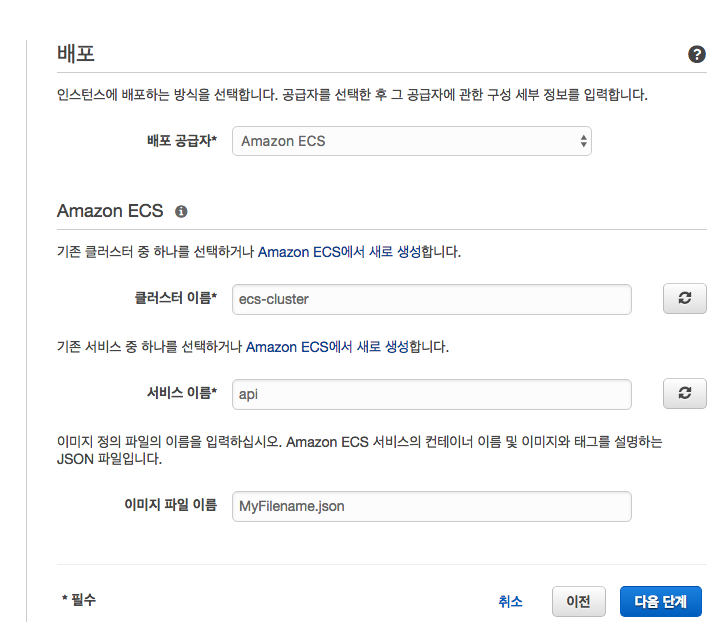

1. 배포 설정
    - 배포 공급자(`Amazon ECS`) 선택
    - 클러스터 이름(`ecs-cluster`) 선택
    - 서비스 이름(`api`) 선택
    - 이미지 파일 이름(`MyFilename.json`) 입력
    - 하단 `다음 단계` 버튼 클릭

2. AWS 서비스 역할 설정
    - `AWS-CodePipeline-Service`를 선택합니다. > 혹시 해당 역할이 없다면 오른쪽 `역할 만들기` 버튼을 클릭합니다.

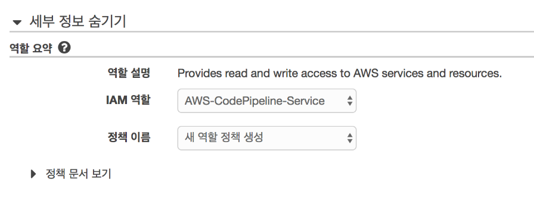

- `다음 단계` 버튼 클릭
- 파이프라인 설정 검토 이후 하단 `파이프라인 생성` 버튼을 클릭합니다.

### buildspec 설정 및 Github에 Push
#### buildspec 생성 및 정의

> 포크하신 `Fastcampus-api-deploy` 디렉토리 내에 `buildspec.yml`를 생성하여 아래 내용을 추가합니다.
스크립트 안에 주석에 적힌 내용을 확인하신 후 적용하신 뒤에 저장합니다.
혹시 아래 코드를 복사하기 힘드시면 [buildspec.yml](https://github.com/owen1025/Fastcampus-api-deploy/blob/container/buildspec.yml)로 접속하여 복사 후 수정합니다.

```bash
version: 0.2

phases:
  pre_build:
    commands:
      - echo Logging in to Amazon ECR...
      - aws --version
      - $(aws ecr get-login --region $AWS_DEFAULT_REGION --no-include-email)
      - REPOSITORY_URI=322749112518.dkr.ecr.ap-northeast-2.amazonaws.com/api-repo # web 이미지가 저장된 ECR 리포지토리 URL을 입력합니다. ex. REPOSITORY_URI={ECR-API-REPO-URL}
      - IMAGE_TAG=$(echo $CODEBUILD_RESOLVED_SOURCE_VERSION | cut -c 1-7)
  build:
    commands:
      - echo Build started on `date`
      - echo Building the Docker image...          
      - docker build -t $REPOSITORY_URI:latest .
      - docker tag $REPOSITORY_URI:latest $REPOSITORY_URI:$IMAGE_TAG
  post_build:
    commands:
      - echo Build completed on `date`
      - echo Pushing the Docker images...
      - docker push $REPOSITORY_URI:latest
      - docker push $REPOSITORY_URI:$IMAGE_TAG
      - echo Writing image definitions file...
      - printf '[{"name":"api-container","imageUri":"%s"}]' $REPOSITORY_URI:$IMAGE_TAG > MyFilename.json
artifacts:
    files: MyFilename.json
```


> AWS Codepipeline 테스트를 위해 Github에 Push하여 CI/CD 과정이 정상적으로 작동하는 지 확인합니다.
```bash
git add --all
git commit -m "ci/cd test"
git push
```

</br>

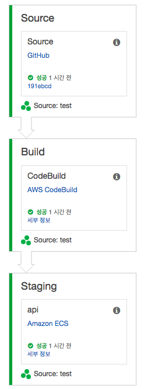

> 해당 화면과 같이 Source, Build, Staging 과정이 성공하면 정상적으로 작동하는 겁니다. 수고하셨습니다.