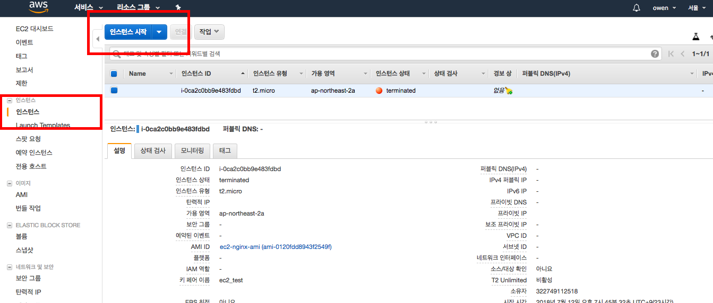
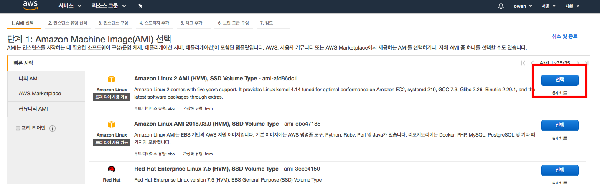
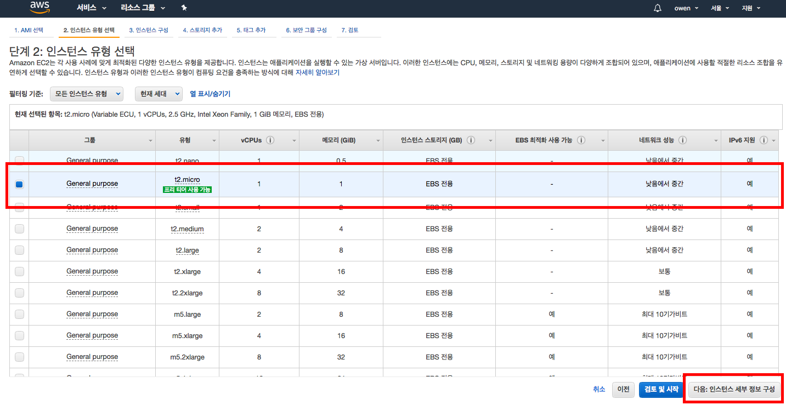
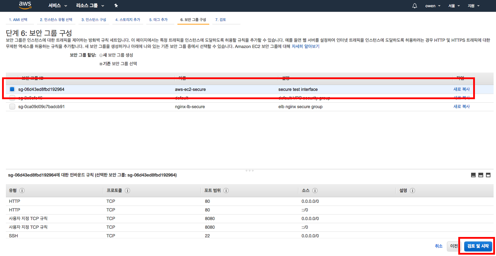
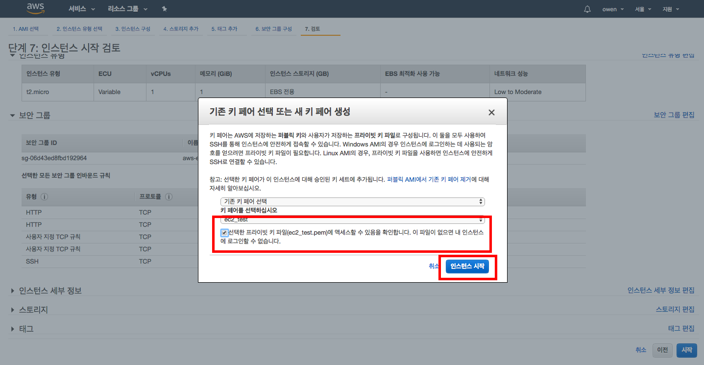
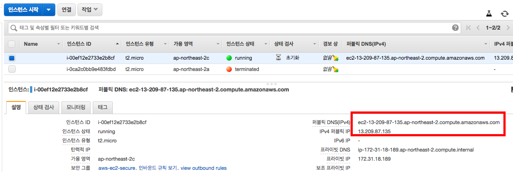

# AWS EC2, Nginx 설치/운영
## AWS EC2 인스턴스 생성하기


1. AWS Management console에 로그인 후 접속합니다.
2. 서비스 - EC2 클릭 후 인스턴스 시작 버튼 클릭
</br></br>



1. Amazon Linux 2 AMI (HVM), SSD Volume Type를 기반으로 생성합니다.
</br></br>


1. 인스턴스 유형 선택에서 t2.micro(프리 티어)를 체크합니다.
2. 하단 - 다음:인스턴스 세부 정보 구성 버튼을 클릭합니다.
3. 3\. 인스턴스 구성, 4\. 스토리지 추가, 5\. 태그 추가 탭에 설정할 내용은 현재는 기본 값을 사용하기 때문에 다음 스텝으로 넘어갑니다.
4. 6\. 보안 그룹 구성 탭까지 이동합니다.
</br></br>


1. 기존 보안 그룹 선택 클릭
2. 1주차에 작성한 보안 그룹인 aws-ec2-secure을 클릭합니다.
    - ssh(22), http(80) 포트만 설정되어있으면 됩니다. (하단 참조)
3. 검토 및 시작을 클릭합니다.
</br></br>



1. 검토 탭에서 하단 - 시작 버튼을 클릭하면 키 페어 선택 팝업이 뜹니다.
2. 1주차에 만든 SSH 퍼블릭 키를 사용하기 위해 기존 키 페어 선택 - ec2_test를 각각 체크합니다.
3. 하단 "선택한 프라잆 키 파일에 액세스할 수 있음을 확인합니다. ~~~" 내용에 체크합니다.
4. 인스턴스 시작 버튼 클릭
5. 인스턴스 보기 버튼 클릭
</br></br>


1. 방금 생성한 EC2 인스턴스 상태가 Pending에서 running으로 바뀐 것을 확인합니다.
2. 하단 - 설명 탭을 클릭하고 퍼블릭 DNS 주소를 복사합니다.
```bash
sudo ssh -i ~/Desktop/ec2_test.pem ec2-user@{ec2_dns}
```
3. ssh 클라이언트를 통해 방금 생성한 EC2 인스턴스로 접속합니다.
</br></br>

## Nginx 설치
```bash

```