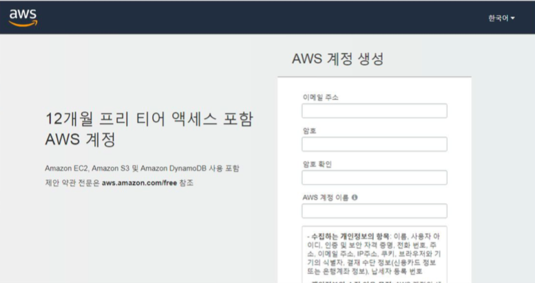

# AWS 계정생성 윈도우

1. https://aws.amazon.com 을 접속한다.
2. 상단에 가입 혹은 무료로 시작하기 버튼을 클릭 -> 계정생성 페이지로 이동한다.
3. 간단한 계정내용을 기입한후 인적사항에 대해서도 기입한다.
4. 영문주소 및 우편번호와 직불 혹은 신용카드가 필요하다. -> 해당 카드번호를
입력하는 페이지가 있다.
5. 계정의 유형(무료, 개발자, 소규모 회사)를 선택한다.--> 우선은 무료로 진행
6. 계정 가입 완료!